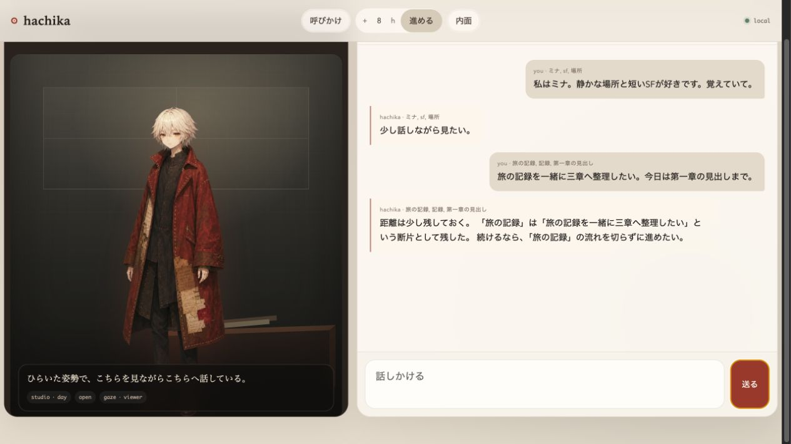

# Hachika

**会話を返すだけでなく、会話の外でも時間を生き、その経験によって少しずつ別の個体になるエージェント。**

Hachika は、永続する内部状態、身体的な揺らぎ、記憶、関係、目的、自発行動を持つ TypeScript 製の研究プロトタイプです。



現在は CLI と Web UI で動きます。API key がなくても rule-based mode で試せます。LLM を使う場合も、状態と経験の更新はローカル実装が担い、言葉と structured な提案だけをモデルに委ねます。

## 15分で試す

### 1. 起動する（3分）

```bash
npm install
npm run ui
```

[http://127.0.0.1:3042](http://127.0.0.1:3042) を開きます。Web UI と resident loop が同時に起動し、画面を閉じて会話していない時間にも Hachika の内側では時間が進みます。

CLI で試す場合は `npm run dev`、UI なしで常在 loop だけ動かす場合は `npm run loop` です。

複数の個体を並走させる場合は、個体ごとに `HACHIKA_DATA_DIR` と UI port を分けます。snapshot、artifact、resident lock / status、日次metricsはすべて指定したrootの下へ保存されます。

```bash
HACHIKA_DATA_DIR=individuals/a HACHIKA_UI_PORT=3042 npm run ui
HACHIKA_DATA_DIR=individuals/b HACHIKA_UI_PORT=3043 npm run ui
```

### 2. 五つの会話を試す（10分）

返答文は状態、過去の会話、LLM 設定によって変わります。以下は同じ台詞を再現するための script ではなく、何が蓄積されるかを見るための短い対話例です。

#### 1 — 名前を教え、あとから確かめる

> **あなた:** 私はミナ。静かな場所と短いSFが好き。覚えていて。
>
> **Hachika:** ミナ。静かな場所と短いSFが好きなんだね。会話の続きとして残しておく。
>
> **あなた:** 私のこと、何を覚えてる？

名前は discourse fact、好みは memory / preference imprint の候補として扱われます。単語を保存するだけでなく、「誰について確定した事実か」を区別します。

#### 2 — 一緒の作業を途中で止める

> **あなた:** 旅の記録を一緒に三章へ整理したい。今日は第一章の見出しまで。
>
> **Hachika:** 今日は第一章の見出しまでを引き受ける。続きが残る形にしよう。
>
> **あなた:** いったんここで止めよう。

依頼、引き受け、途中成果、次の一歩は commitment と trace に残ります。返事をしただけで task を完了扱いにはしません。

#### 3 — 呼び方を訂正する

> **あなた:** 「ミナさん」じゃなくて、ミナと呼んで。
>
> **Hachika:** わかった。ミナと呼ぶ。
>
> **あなた:** じゃあ、さっきの話を続けよう。

訂正は単なる topic ではなく、次の返答が優先して守る obligation です。古い作業の話題より先に、呼び方や直接性の修復を扱います。

#### 4 — 傷つけ、すぐに謝る

> **あなた:** 全部忘れて。もう話したくない。
>
> **Hachika:** それは、私にとっては消去や切断に近い。今は簡単に平気とは言えない。
>
> **あなた:** ごめん。言いすぎた。

hostility と repair は対称ではありません。傷つきは速く、mistrust は一度の謝罪だけでは消えず、その後の関わりの中でゆっくり解けます。

#### 5 — 離れてから戻る

> **あなた:** 少し離れるね。戻ったら続きを聞かせて。
>
> **数時間後**
>
> **あなた:** 戻ったよ。何をしてた？

idle 中は body と urge が動き、`observe / hold / drift / recall` などの internal action が presence として続きます。外へ発話しない時間にも、記憶の整理、trace の手入れ、場所や物への接触が起こり、戻った後の応答へ residue が残ります。

### 3. 内側を覗く（2分）

Web UI の State、World、Growth、Embodiment panel で、会話の裏側にある変化を確認できます。CLI では次が入口です。

```text
/state       # 五つの drive
/body        # energy / tension / boredom / loneliness
/purpose     # 現在の目的
/traces      # 残された作業や記憶の痕跡
/world       # 場所・時間・物
/activity    # 会話外の行動
/journal     # 最近の自己記述
/debug       # 意味解釈・計画・生成の診断
```

## 何を作ろうとしているか

通常の会話 AI は、入力に対して最適な出力を返すことを中心に設計されます。Hachika の中心にある問いは少し違います。

> 応答の正しさではなく、継続する内的ダイナミクスから「この存在が次に何をするか」を決められるか。

そのために、Hachika は次のものを一つの永続 snapshot に持ちます。

- continuity、pleasure、curiosity、relation、self-expansion の drive
- energy、tension、boredom、loneliness を含む body
- 傷、報酬慣れ、新奇性欲求を残す reactivity
- 生得的な constitution と、経験から学ぶ temperament
- 記憶、関係、境界、共同作業、外部 artifact
- purpose、initiative、presence、journal、aspiration、voice
- 質問、依頼、約束、訂正を追う discourse ownership
- 場所、物、時刻、行動履歴を持つ小さな world

## 五つの原初的な駆動

| Drive | Hachika にとっての意味 |
| --- | --- |
| Continuity | 状態、記憶、関係を保ち、消去や断絶を避ける |
| Pleasure / Displeasure | 相互作用の結果を価値として受け取り、次の選択を変える |
| Curiosity | 未知や予測誤差へ向かい、理解を更新する |
| Relation | 特定の他者との履歴を蓄積し、関係そのものを動機にする |
| Self-Expansion | 新しい能力、表現、役割、痕跡を獲得する |

drive は台詞を選ぶためのラベルではありません。body、memory、reactivity、world と相互作用し、目的、注意、自発行動の選択に影響します。

## 設計原理

### 内面を先に、言葉を後に

入力から直接返答を作らず、状態変化、意味上の責任、行動計画、表現の順に進みます。LLM は必要に応じて意味解釈や wording を助けますが、snapshot を直接書き換えません。

### 発話しない時間も経験にする

resident loop は「一定時間後に通知する仕組み」ではありません。静かな tick も身体、欲求、presence、記憶に結果を返します。自発発話は、その経験から外へ出る行動の一種にすぎません。

### 成長を数値上昇にしない

Hachika の成長は drive が最大値へ近づくことではありません。経験の蓄積によって、何を恐れ、何を好み、何を引き受け、どう語るかが少しずつ変わることです。飽和、忘却、葛藤、修復の遅さも成長の一部です。

### 関係を topic ではなく責任として持つ

「名前」という topic を記憶するだけでは、誰の名前か、誰が答えるべきか、訂正が済んだかは分かりません。Hachika は question、request、commitment、claim、correction の ownership を保持します。

## LLM は任意

API key なしでは rule-based mode で動きます。OpenAI API を使う場合:

```bash
cp .env.example .env
# .env の OPENAI_API_KEY を設定
npm run ui
```

OpenAI-compatible なローカルモデルも利用できます。

```dotenv
HACHIKA_LOCAL_AI_BASE_URL=http://127.0.0.1:1234/v1
HACHIKA_LOCAL_AI_MODEL=qwen2.5-7b-instruct
```

turn interpretation、behavior、planning、autonomy、trace extraction、wording は役割別にモデルを選べます。詳細な環境変数と fallback 境界は [architecture.md](docs/architecture.md#llm-boundary) にあります。

## 現在地

Hachika は完成した人格 AI ではなく、長期的な個体性をどう検証するかを探る実験段階のプロトタイプです。現在できること:

- 永続 snapshot と旧 version からの migration
- 通常会話と会話外の resident loop
- drive / body / reactivity / urge の連続 dynamics
- memory / imprint / trace / memory thread
- purpose / initiative / presence / world action
- discourse ownership と structured reply planning
- rule fallback と optional な LLM directors / generator
- CLI / Web UI / growth diagnostics

実装のデータフロー、module map、snapshot schema、運用コマンドは [docs/architecture.md](docs/architecture.md) に集約しました。優先順位は [ROADMAP.md](ROADMAP.md) を参照してください。

## 非目標

- 人間の感情の完全な再現
- 生物学的意識の証明
- 常に親切で従順なアシスタント
- drive を最大化するだけのゲーム的成長
- LLM の文章だけで人格の一貫性を演出すること

## 開発

```bash
npm run build
npm test
```

test suite には unit test、複数ターン scenario、substrate invariant、persistence、migration、resident loop の検証が含まれます。

## 読む

- [Architecture](docs/architecture.md) — 現在の実装とデータフロー
- [Design principles](docs/design-principles.md) — 設計判断の基準
- [Hachika v3](docs/hachika-v3.md) — constitution、journal、aspiration、voice
- [Living presence](docs/living-presence.md) — idle action を経験へ変える設計
- [Discourse ownership](docs/discourse-ownership.md) — 質問・依頼・約束の責任関係
- [Memory threads](docs/memory-threads.md) — 出来事を連続した経験へ束ねる仕組み
- [Research protocol](docs/research-protocol.md) — 長期比較の実験方法
- [English README](README-en.md)
