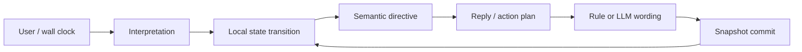
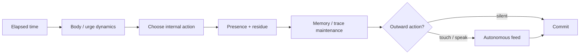

# Hachika architecture

この文書は、現在の実装を読むための地図です。思想と最短の体験導線は [README](../README.md)、今後の優先順位は [ROADMAP](../ROADMAP.md) を参照してください。

## 実装の境界

Hachika は Node.js + TypeScript で動く、永続状態を持つ会話エージェントです。会話文そのものより先に、次の3層を分離しています。

1. **状態と経験** — drive、身体、反応履歴、記憶、関係、世界、現在の行動をローカルで保持する
2. **意味と行動の決定** — 入力を解釈し、何に応じ、何を残し、次に何をするかを structured data として決める
3. **表現** — 決定済みの意図を rule-based または LLM で言葉にする

LLM を無効にしても状態更新と最低限の応答は動きます。LLM を有効にした場合も、snapshot を直接編集させず、schema validation を通った提案だけを TypeScript 側が採用します。



## Snapshot

永続化単位は `HachikaSnapshot` です。現在の schema version は **33** です。

| 領域 | 主な値 | 役割 |
| --- | --- | --- |
| substrate | `dynamics`, `body`, `reactivity`, `urges` | 安全、覚醒、疲労、孤独、傷つき、接触欲求などの連続状態 |
| individuality | `constitution`, `temperament`, `voice` | 生得的な基準点、経験から学ぶ気質、表現の癖 |
| experience | `memories`, `imprints`, `traces`, `memoryThreadEvents` | 会話の記憶、長期的な傾向、外に残す痕跡、出来事の連なり |
| agency | `purpose`, `initiative`, `presence`, `aspirations`, `journal` | 現在の目的、次の行動、今していること、長期方向、自己記述 |
| relation | `attachment`, `discourse` | 関係の蓄積と、質問・依頼・約束・訂正の責任関係 |
| world | `world`, `autonomousFeed` | 場所、物、時間、会話外で起きた行動 |
| diagnostics | `generationHistory`, `revision`, clocks | 生成品質、保存競合、経過時間の追跡 |

外部に見える drive と body は `dynamics` substrate から導出します。旧来の二重更新経路は退役しており、無入力時の平衡、飽和しないこと、傷の履歴、idle 中の退屈と孤独を invariant test で固定しています。

## User turn pipeline

通常の会話ターンは概ね次の順で進みます。

1. snapshot を読み込み、入力を rule-based signal に変換する
2. optional な `input-interpreter` / `turn-director` で subject、対象、返答義務、semantic topic を補正する
3. drive、body、reactivity、関係、discourse state を更新する
4. 記憶、imprint、trace、memory thread、purpose、initiative を更新する
5. `response-planner` が act、stance、distance、focus を決める
6. expression perspective と composition brief を作る
7. rule-based fallback または `reply-generator` が最終文面を作る
8. generation diagnostics を記録し、snapshot と artifact を保存する

`topics` と `stateTopics` は意図的に分かれています。前者はその場で返答するための参照、後者は memory、trace、purpose に残してよい durable topic です。この境界により、挨拶や一時的な抽象語が長期状態を汚染しにくくなります。

### Discourse ownership

`discourse` は topic の一覧ではなく、「誰が何を言い、次に誰が応じるか」を持ちます。

- `openQuestions`: 質問者と回答を期待される相手
- `openRequests`: 依頼者と責任を持つ相手
- `commitments`: `open / accepted / renegotiated / fulfilled / released` の約束台帳
- `recentClaims`: 名前、関係、作業などの直近の主張
- `lastCorrection`: 呼び方や直接性についての訂正

この状態は director、purpose、initiative、reply generation に共有されます。詳細は [discourse-ownership.md](discourse-ownership.md) を参照してください。

## Idle and resident loop

`npm run loop` または Web UI 内蔵の resident loop は、壁時計時間をもとに会話外の時間を進めます。



internal action は `observe / hold / drift / recall` を中心に選ばれ、現在の `presence` として一定時間持続します。行動は urge、身体、記憶、world object に結果を返し、ユーザーが戻ると止まっても `residue` が残ります。

outward action は internal action の一部だけです。発話しない tick も生存時間として状態を変えます。optional な autonomy / proactive director は候補を `keep / suppress / reshape` できますが、適用と永続化はローカル実装が行います。

詳しい設計意図は [autonomy-v2.md](autonomy-v2.md) と [living-presence.md](living-presence.md) にあります。

## Memory, traces, and threads

- 短期の `memories` は古い tail を圧縮し、反復 topic を consolidated memory にまとめる
- 長期 imprint は `preference / boundary / relation` に分ける
- `traces` は `memo / fragments / decisions / nextSteps` を持つ再利用可能な作業痕跡
- trace は `data/artifacts/deepen|preserve|steady/` 以下の Markdown に materialize される
- resolved trace は archive へ移り、関連する出来事や欲求が生じると reopen できる
- `memory threads` は trace、artifact、memory の共起から複数 episode を時系列として束ねる

thread lifecycle は `active / parked / closed / reopened / resolved` です。frontier は `open question → open task request → blocker → next step → new episode → settled` の優先順を持ち、同じ frontier を言い換えて何度も自発発話しないよう checkpoint します。

## Purpose, identity, and individuality

`self-model` は drive、身体、関係、記憶、trace から現在の motive conflict を作ります。その上で active purpose が数ターン持続し、進捗、達成、放棄、遷移を記録します。identity は最近の経験から summary、arc、traits、anchors を更新します。

v3 の個体差レイヤーは次の役割を持ちます。

- `constitution`: 誕生時に決まる基準点と可塑性
- `temperament`: 修復、敵意、共同作業、放置の履歴からゆっくり学ぶ気質
- `journal`: nightlyの直前まで実際に続いたpresence episode（場所・対象・滞在時間・attention rationale・前episodeのresidue）から生成される短い自己記述
- `aspirations`: 長期的な向かい先と緊張関係
- `voice`: 好む入り方や簡潔さなど、表現に残る癖

constitution の差は小さく保ち、同じ初期条件でも経験の違いが徐々に個体差へ変わるようにしています。

## World and embodiment

world state は clock、phase、current place、object state、recent events を持ちます。presence と world action はアバターの姿勢、視線、呼吸へ投影されます。Web UI は会話、内部状態、world、growth metrics、embodiment を同じ snapshot から表示します。

## LLM boundary

OpenAI または OpenAI-compatible endpoint は役割ごとに差し替えられます。

| 役割 | 主な責務 | 環境変数 |
| --- | --- | --- |
| turn | ターン全体の semantic directive | `OPENAI_TURN_MODEL` |
| interpreter | 入力種別と signal の正規化 | `OPENAI_INTERPRETER_MODEL` |
| behavior | harden / suppress / repair などの境界判断 | `OPENAI_BEHAVIOR_MODEL` |
| initiative | pending initiative の裁定 | `OPENAI_INITIATIVE_MODEL` |
| planner | 通常返答の plan 補正 | `OPENAI_PLANNER_MODEL` |
| proactive | 自発行動の emit / suppress / reshape | `OPENAI_PROACTIVE_MODEL` |
| autonomy | idle action と outward mode の裁定 | `OPENAI_AUTONOMY_MODEL` |
| trace | structured trace 抽出 | `OPENAI_TRACE_MODEL` |
| reply | 最終 wording | `OPENAI_MODEL` |

すべて未設定なら rule fallback を使います。`OPENAI_API_KEY` がある場合は OpenAI API、`HACHIKA_LOCAL_AI_BASE_URL` がある場合はローカルの OpenAI-compatible endpoint を利用できます。役割別の local model に `off` または `rule` を指定すると、その役割だけ fallback に戻せます。

HTTP、JSON 抽出、エラー処理は `src/llm-client.ts` に集約しています。各 director は payload 構築、schema validation、sanitation を担当します。生成が空、invalid、または品質閾値を下回った場合は再生成または rule-based wording に退避します。

## Persistence and migrations

一個体の永続データは一つのdata rootへ束ねます。既定は`data/`で、`HACHIKA_DATA_DIR`に相対または絶対パスを指定すると個体ごとに差し替えられます。CLI、Web UI、resident daemonは同じresolverを使います。

- snapshot: `<data-root>/hachika-state.json`
- resident lock / status: `<data-root>/resident-lock.json`, `<data-root>/resident-status.json`
- trace artifacts: `<data-root>/artifacts/`
- metrics / archive（Sprint 0で使用）: `<data-root>/metrics-log.jsonl`, `<data-root>/archive-snapshots/`
- 保存形式: temporary file + rename による atomic write
- compatibility: 古い snapshot を load 時に version 33 へ hydrate / sanitize
- conflict handling: `revision` を比較し、CLI / UI / loop 側が競合時に最新 snapshot から1回再試行

```bash
HACHIKA_DATA_DIR=individuals/a npm run loop
HACHIKA_DATA_DIR=individuals/b npm run loop
```

個体rootを分けることでlockとstatusも分離され、同じcheckoutから複数個体を並走できます。相対パスは起動時のworking directoryを基準に解決します。

`commitSnapshot` の revision check と write は単一プロセス内の逐次実行を前提にしています。複数プロセスが同時に check を通過する可能性を完全には排除していないため、厳密な inter-process CAS / file lock は今後の課題です。

migration fixture は `src/fixtures/snapshots/` に保存し、実際の旧 schema から現行 schema への読み込みを test しています。

## Module map

| 領域 | 主なモジュール |
| --- | --- |
| central orchestration | `engine.ts`, `turn-discourse.ts` |
| state dynamics | `state.ts`, `dynamics.ts`, `body.ts`, `presence.ts`, `world.ts` |
| memory and self | `memory.ts`, `traces.ts`, `memory-threads.ts`, `purpose.ts`, `identity.ts` |
| individuality | `temperament.ts`, `journal.ts`, `aspiration.ts`, `voice.ts` |
| semantics | `semantic-director-schema.ts`, `turn-director.ts`, `input-interpreter.ts`, `behavior-director.ts` |
| agency | `initiative.ts`, `initiative-director.ts`, `autonomy-director.ts`, `proactive-director.ts` |
| expression | `response-planner.ts`, `expression.ts`, `reply-generator.ts`, `generation-quality.ts` |
| persistence | `persistence.ts`, `atomic-file.ts`, `artifacts.ts`, `conflict-retry.ts` |
| runtimes | `index.ts`, `ui-server.ts`, `resident-loop.ts`, `resident-runtime.ts` |

`engine.ts` は現在も orchestration の中心ですが、discourse の記録・整理は `turn-discourse.ts` へ分離済みです。今後は turn pipeline と idle pipeline をさらに明確な境界へ分割します。

## Operation

```bash
npm install
npm run dev   # CLI
npm run ui    # Web UI + resident loop, http://127.0.0.1:3042
npm run loop  # headless resident loop
npm run build
npm test
```

resident loop は既定で実際の経過時間を進めます。`HACHIKA_LOOP_INTERVAL_MS` で tick 間隔を、明示的な simulation では `HACHIKA_LOOP_IDLE_HOURS_PER_TICK` で固定経過時間を設定できます。

主な CLI inspection command:

- 状態: `/state`, `/body`, `/reactivity`, `/urges`, `/temperament`, `/constitution`
- 経験: `/memory`, `/imprints`, `/traces`, `/activity`, `/artifacts`
- 自己: `/self`, `/identity`, `/purpose`, `/journal`, `/aspirations`
- 環境: `/world`, `/loop`
- 診断: `/llm`, `/metrics`, `/debug`
- 操作: `/proactive`, `/idle <hours>`, `/reset`, `/exit`

## Tests and observability

`npm test` は unit、multi-turn scenario、substrate invariant、migration、persistence conflict、resident loop を含みます。generation diagnostics では provider / model / fallback / plan diff / retry count に加え、overlap、opener echo、abstract ratio、concrete detail、focus mention を記録します。

設計判断の優先順位は [design-principles.md](design-principles.md)、比較指標は [growth-metrics.md](growth-metrics.md)、研究プロトコルは [research-protocol.md](research-protocol.md) を参照してください。
